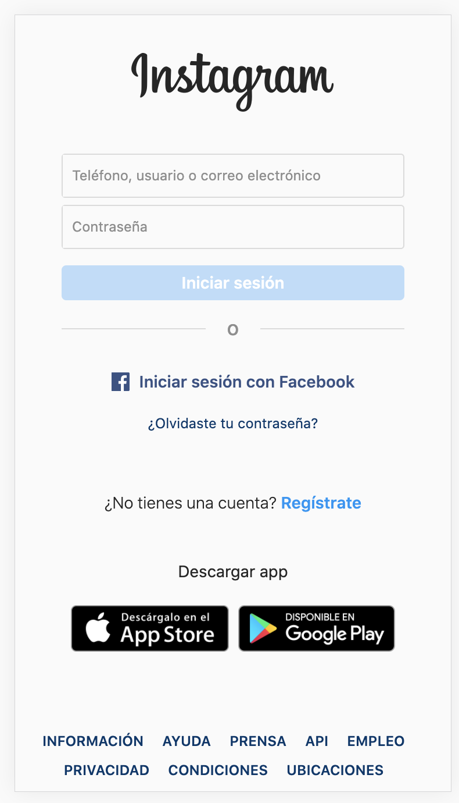
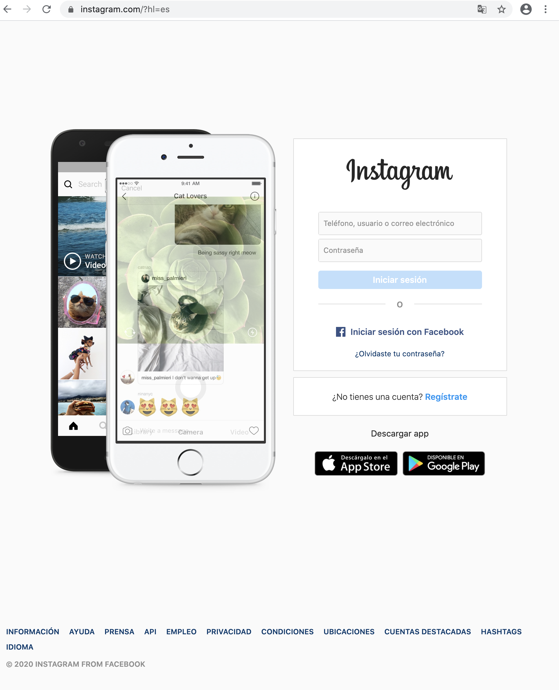

# Bootcamp Web - Clon de Instagram

Este ejercicio consiste en replicar la página web de instagram. 
Esta vez no utilizaremos Repl.it, ya que el objetivo es utilizar nuestro entorno de trabajo local
que ya tenemos configurado. 

Vamos a utilizar Boostrap 4 para que la página sea responsive.

## Cómo comenzar

1- Clona el repositorio`git clone git@github.com:awagner12/bootcamp-web-instagram.git`.

2- Abre el proyecto con tu IDE preferido.

3- En el directorio raíz tendrás index.html y dentro del directorio css `styles.css`, estos 2 archivos son los que
tendrás que modificar.\
`index.html`\
`css/styles.css`

4- Utiliza las imágenes dentro del directorio img.

**IMPORTANTE**: recuerda que para aprender a programar tendrás que practicar, buscar en internet y probar diferentes formas de hacer las cosas. Por lo tanto no debes mirar la solucion hasta haber pasado al menos 3 horas realizando el ejercicio. Lo ideal es que no lo mires hasta que hayas acabado. De esta manera aprenderás de los errores y las dificultades.

## Resultado esperado

### Mobile

### Tablet

### Desktop

